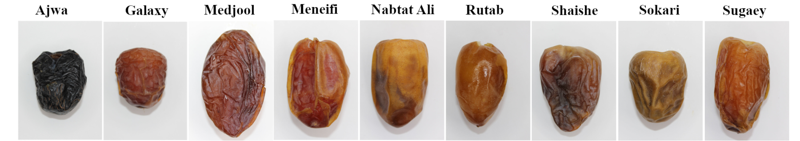

# OCI Object detection

The idea with this notebook is to create a custom dataset, using the datalabeling and vision service of Oracle Cloud, to detect different types of dates-fruit.

I wrote a blog explaining how to use this repository https://medium.com/@carlgira/ai-vision-model-on-oci-for-object-detection-c47ac63114fc


I'll be using the landmaks dataset v2 https://www.kaggle.com/datasets/wadhasnalhamdan/date-fruit-image-dataset-in-controlled-environment.



## Initial Setup

1. Follow the instructions to configure oci cli and to create API keys to authenticate against OCI that are in this blog https://medium.com/@carlgira/install-oci-cli-and-configure-a-default-profile-802cc61abd4f

2. To start the notebook create a conda enviroment using the next commands.

```
    conda env create --name oci-object-detection-env --file environment.yml
    conda activate oci-object-detection-env
```

3. Once the enviroment is activated start jupyter.

```
    jupyter-lab
```

